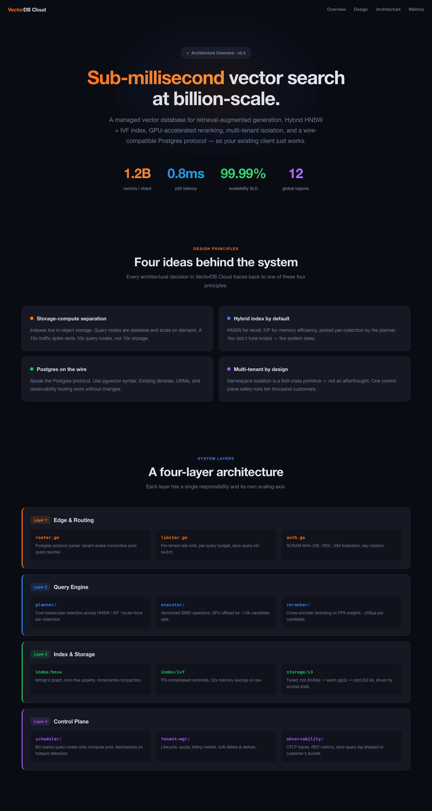

# dark-tech-style

A Claude Code / Claude.ai skill that gives Claude a complete, opinionated visual style for building dark-themed technical web pages: architecture overviews, product showcases, dashboards, roadmaps, technical landing pages, one-pagers.

> 暗色科技风 HTML 一页应用的视觉风格系统。架构图、技术全景页、Landing、Dashboard、Roadmap、技术汇报页 — 一句话需求出一份风格统一的成品。

## What you get

A signature aesthetic: near-black 4-level background, barely-there 6% borders, ultra-tight 800-weight headlines, 7-color accent palette with `dim` variants, glassmorphic nav, gradient stat numbers, and 14 ready-to-use component classes.



> Above: a fictional "VectorDB Cloud" architecture page rendered from [`docs/demo.html`](docs/demo.html), built entirely with the tokens and components in this skill.

## Style fingerprint

- **Background**: `#0a0c14` → `#10121c` → `#161924` → `#1c1f2e` (four levels)
- **Text**: `#e2e5ef` / `#7a7f96` / `#4a4e63` (three levels, no pure white)
- **Borders**: `rgba(255,255,255,0.06)`, lifts to `0.12` on hover
- **Accents**: orange / blue / green / gold / purple / red / cyan — each with a 15%-alpha `dim` variant
- **Type**: SF Pro / PingFang for body; SF Mono / Fira Code for code
- **Headlines**: `font-weight: 800`, `letter-spacing: -0.02em` to `-0.03em`
- **Radii**: `14px` for cards, `8px` for chips
- **Effects**: 20px backdrop-blur nav, radial-gradient hero halo, pulse animation on status dots, 135° gradient text for stats

## Install

### Claude Code

```bash
git clone https://github.com/harrisliangsu/dark-tech-style.git ~/.claude/skills/dark-tech-style
```

Or symlink from a clone elsewhere:

```bash
git clone https://github.com/harrisliangsu/dark-tech-style.git ~/dev/repo/dark-tech-style
ln -s ~/dev/repo/dark-tech-style ~/.claude/skills/dark-tech-style
```

Restart Claude Code (or start a new session) and the skill will appear in the available-skills list.

### Claude.ai

Upload the directory as a custom skill via Settings → Skills.

## Usage

Just describe what you want to build:

- "做一个架构图，6 个阶段流水线，附路线图"
- "Landing page for an AI coding agent, dark theme, 4 hero stats"
- "技术汇报一页应用，3 层架构 + 防御机制 + KPI"
- "Dashboard 概览页，深色科技风"

The skill auto-triggers and Claude will pull the design tokens, pick an accent color per section, and output a single-file HTML page using the component recipes.

You can also invoke it explicitly:

```
/dark-tech-style 帮我做一个 KMS 系统的架构全景页
```

## Repository layout

```
dark-tech-style/
├── SKILL.md              # rules, color laws, section patterns, anti-patterns
├── assets/
│   ├── tokens.css        # CSS variables + 14 component classes
│   └── starter.html      # section skeletons (hero / cards / layers / timeline / terminal)
├── README.md
└── LICENSE
```

## Three rules that matter most

These are the rules you'll see Claude apply — they're the ones most often violated when this style gets imitated by hand:

1. **One accent per section.** Pick a color (orange / blue / green / etc.) and use it for every element in that section — kicker, card rail, badge, dot, stat gradient. Don't mix.
2. **`-dim` variants are backgrounds only.** Never use a 15%-alpha color as text — it's unreadable. Use the solid accent for text/border/icon, the `-dim` variant only for fills.
3. **Take colors from tokens, never hardcode hex.** If you find yourself typing `#3b82f6`, use `var(--accent-blue)` instead.

## Credits

The visual language was extracted from a "Ship Rail" architecture page authored by **YiKong (易空)** — credit to the original designer for the aesthetic. This repo packages the system as a reusable Claude skill.

## License

MIT — see [LICENSE](LICENSE).
