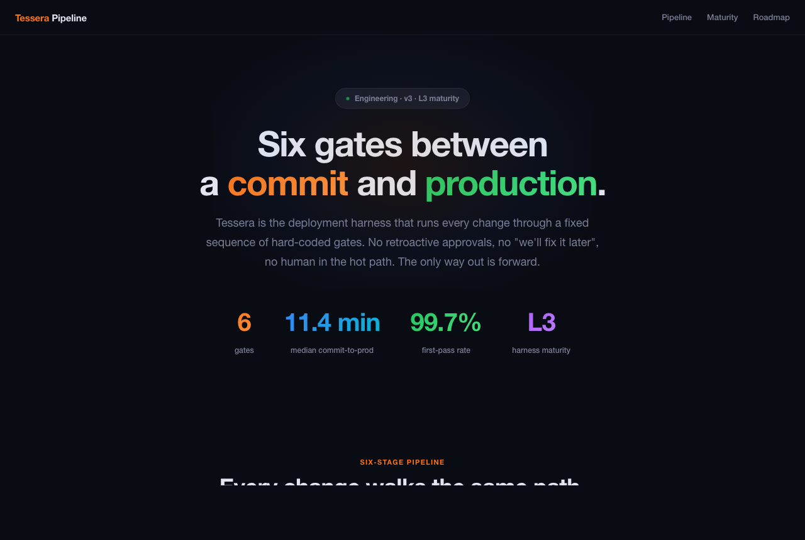
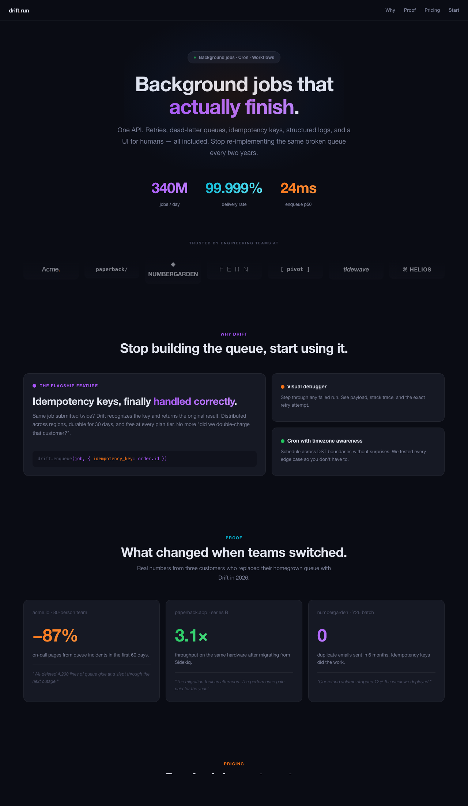

<div align="right">

[English](README.md) · **简体中文**

</div>

# dark-tech-style

一个 Claude Code / Claude.ai 技能，给 Claude 装上一套完整的、有主见的暗色科技风视觉语言。用来生成架构图、技术全景页、产品 Landing、Dashboard、Roadmap、技术汇报页 —— **一句话需求出一份风格统一的成品**。



> 上图是 [`docs/demo.html`](docs/demo.html) 的 hero —— 虚构的 "Tessera" 部署流水线页，完全用本技能的 token 和组件搭出来。完整 demo 和 SaaS 变体见下方 Gallery。

## 这套技能给你什么

一种带签名感的视觉：四级近黑背景、几乎不可见的 6% 边框、超粗 800 字重 + 强烈负字距大标题、7 色高亮系（每色都配 15% 透明的 `dim` 变体）、玻璃态导航、渐变数字、14 个开箱即用的组件类。

## Gallery

同一套技能，完全不同的内容。两个页面都来自 `assets/tokens.css` + `assets/starter.html`，没有任何页面级自定义 CSS。

| [Tessera · 部署流水线](docs/demo.html) | [Drift · SaaS Landing](docs/demo-saas.html) |
|---|---|
|  |  |
| 工程过程调性：横向 6 阶段流水线 · 不对称成熟度阶梯（带 "现在位置"高亮）· 横向 Gantt 路线图。 | 产品营销调性：Trusted-by logo 条 · 不对称 1+2 卖点布局（含代码片段）· 大数字社会证明 · 三档定价 · 终端 CTA。 |

## 风格指纹

- **背景**：`#0a0c14` → `#10121c` → `#161924` → `#1c1f2e`（四层）
- **文字**：`#e2e5ef` / `#7a7f96` / `#4a4e63`（三级，不要纯白）
- **边框**：`rgba(255,255,255,0.06)`，hover 升到 `0.12`
- **高亮色**：橙 / 蓝 / 绿 / 金 / 紫 / 红 / 青 —— 每色都有 15% 透明的 `dim` 变体
- **字体**：正文 SF Pro / PingFang；代码 SF Mono / Fira Code
- **大标题**：`font-weight: 800`，`letter-spacing: -0.02em` 到 `-0.03em`
- **圆角**：卡片 `14px`，小标签 `8px`
- **效果**：导航 20px backdrop-blur、Hero 椭圆光晕、状态点 pulse 动画、数字 135° 渐变

## 安装

### Claude Code

```bash
git clone https://github.com/harrisliangsu/dark-tech-style.git ~/.claude/skills/dark-tech-style
```

或者克隆到别处再做软链：

```bash
git clone https://github.com/harrisliangsu/dark-tech-style.git ~/dev/repo/dark-tech-style
ln -s ~/dev/repo/dark-tech-style ~/.claude/skills/dark-tech-style
```

重启 Claude Code（或开新会话），技能就会出现在可用列表里。

### Claude.ai

在 Settings → Skills 上传整个目录作为自定义技能。

## 使用方式

直接描述你想要什么：

- "做一个架构图，6 个阶段流水线，附路线图"
- "Landing page for an AI coding agent, dark theme, 4 hero stats"
- "技术汇报一页应用，3 层架构 + 防御机制 + KPI"
- "Dashboard 概览页，深色科技风"

技能会自动触发，Claude 会读取 token、给每个章节分配一个高亮色，然后用组件食谱拼出一份单文件 HTML。

也可以显式触发：

```
/dark-tech-style 帮我做一个 KMS 系统的架构全景页
```

## 仓库结构

```
dark-tech-style/
├── SKILL.md              # 规则、颜色法则、章节模式、反模式
├── assets/
│   ├── tokens.css        # CSS 变量 + 14 个组件类
│   └── starter.html      # 章节骨架（hero / 卡片 / 分层 / 时间轴 / 终端）
├── docs/
│   ├── demo.html         # 架构页 demo
│   ├── demo-saas.html    # SaaS Landing demo
│   ├── preview.png       # 架构页截图
│   └── preview-saas.png  # SaaS Landing 截图
├── README.md             # English
├── README.zh.md          # 简体中文
└── LICENSE
```

## 三条最重要的规则

这是 Claude 实际会执行的规则 —— 也是这套风格被手工模仿时最常翻车的三处：

1. **一个 section 一种高亮色**。挑一个色（橙 / 蓝 / 绿 / ...），这个 section 里所有元素 —— kicker、卡片左边框、徽章、圆点、数字渐变 —— 都用这一种。**不要混色**。
2. **`-dim` 变体只用作背景**。15% 透明的颜色不能当文字（看不清）。实色用于文字 / 边框 / 图标，`-dim` 只填充。
3. **永远从 token 取色**。如果你正在打 `#3b82f6`，停手，改用 `var(--accent-blue)`。

## 致谢

视觉语言提取自一份 "Ship Rail" 架构页，原作者 **YiKong（易空）** —— 美学归功于原设计师，本仓库只是把这套语言打包成可复用的 Claude 技能。

## License

MIT —— 详见 [LICENSE](LICENSE)。
